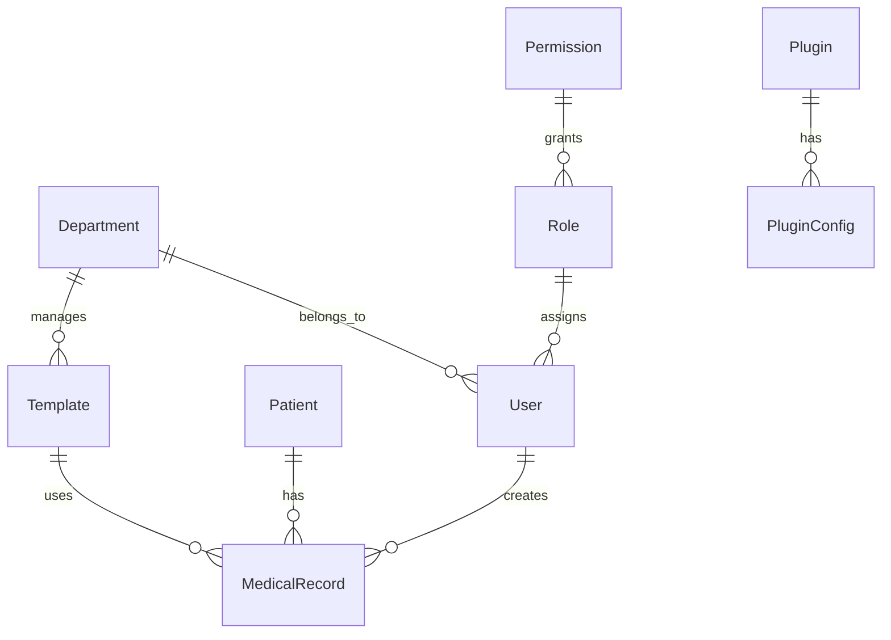

# HIS-DEV 电子病历系统底层框架设计文档

## 📋 项目概述

**HIS-DEV** 是一个基于 xiaoju-survey 架构模式设计的电子病历系统底层框架，创造性地将问卷搭建理念适配到医疗信息化领域，为构建现代化的电子病历系统提供坚实的技术基础。

## 🏗️ 核心设计理念

### 1. 领域化设计思想

将 xiaoju-survey 的问卷搭建理念创造性转换为电子病历系统的**病历模板搭建系统**：

| xiaoju-survey | HIS-DEV | 适配说明 |
|---------------|---------|----------|
| 问卷创建 | 病历模板创建 | 将问卷设计理念适配到医疗场景 |
| 题型组件 | 医疗组件 | 40+题型 → 医疗专业组件（体征、病史、诊断等） |
| 回答数据 | 病历数据 | 结构化问卷数据 → 结构化病历数据 |
| 问卷逻辑 | 医疗逻辑 | 跳转逻辑 → 临床路径和诊断逻辑 |

### 2. 多页应用架构 (MPA)

继承并优化了 xiaoju-survey 的 MPA 架构：

```
前端架构分层：
├── /management  - 管理端（系统管理、模板配置）
├── /usage       - 医生工作站（日常诊疗工作）
└── /view        - 病历查看端（查阅、统计）
```

### 3. 插件化系统

保持 xiaoju-survey 的插件化优势，适配医疗场景：

```typescript
// 医疗插件类型
- 医疗组件插件：体征录入、检验结果、影像报告
- 业务逻辑插件：诊断辅助、用药审查、临床路径
- 第三方集成插件：HIS/EMR对接、医保结算、设备集成
- 安全合规插件：数据加密、访问控制、审计追踪
```

## 🏛️ 技术架构

### 后端架构 (NestJS)

```
server/src/
├── modules/              # 业务模块（领域驱动设计）
│   ├── auth/            # 认证授权模块
│   ├── user/            # 用户管理模块
│   ├── patient/         # 患者管理模块
│   ├── medical-record/  # 病历管理模块
│   ├── template/        # 模板管理模块
│   └── plugin/          # 插件管理模块
├── models/              # 数据模型（TypeORM实体）
├── securityPlugin/      # 安全插件系统
├── common/              # 公共组件
└── middlewares/         # 中间件
```

### 前端架构 (Vue 3 + TypeScript)

```
web/src/
├── management/          # 管理端（B端）
├── usage/              # 医生工作站（专业用户）
├── view/               # 病历查看端（C端）
└── materials/          # 医疗组件库
    ├── medical-components/    # 医疗专业组件
    ├── form-components/       # 表单组件
    ├── layout-components/     # 布局组件
    └── common/               # 公共组件
```

## 📊 数据模型设计

### 核心实体关系



### 关键数据模型

1. **患者模型 (Patient)**
   - 基础信息：姓名、性别、出生日期、身份证号
   - 医疗信息：血型、过敏史、既往病史、家族病史
   - 联系信息：紧急联系人、联系方式

2. **病历模型 (MedicalRecord)**
   - 诊疗信息：主诉、现病史、体格检查、诊断
   - 模板关联：支持基于模板的结构化录入
   - 审核流程：草稿→提交→审核→锁定

3. **模板模型 (Template)**
   - 模板结构：JSON格式的表单定义
   - 版本管理：支持模板版本控制和历史追溯
   - 权限控制：科室级模板权限管理

## 🔐 安全架构

### 多级权限控制

```typescript
// 权限层级设计
系统级权限: 超级管理员、系统管理
科室级权限: 科室管理、科室数据访问
病历级权限: 创建、查看、修改、审核、删除
字段级权限: 敏感数据脱敏、访问控制
```

### 数据安全机制

1. **传输安全**: HTTPS + 数据加密
2. **存储安全**: 敏感字段加密存储
3. **访问控制**: 基于RBAC的细粒度权限
4. **审计追踪**: 完整的操作日志和审计记录

## 🧩 插件系统设计

### 插件架构

```typescript
interface Plugin {
  getName(): string;           // 插件名称
  getVersion(): string;        // 版本号
  init(): Promise<void>;       // 初始化
  execute(context: any): any;  // 执行逻辑
  destroy(): void;             // 销毁清理
}
```

### 插件类型

1. **组件插件**: 自定义病历组件
2. **业务插件**: 医疗业务逻辑扩展
3. **集成插件**: 第三方系统对接
4. **安全插件**: 数据保护和合规

## 🎯 核心特性

### 1. 病历模板搭建系统

- **可视化编辑器**: 拖拽式病历模板设计
- **组件化开发**: 可复用的医疗专业组件
- **动态表单**: 根据模板动态生成录入界面
- **智能验证**: 医疗数据的业务规则验证

### 2. 多端应用架构

- **管理端**: 系统管理、用户管理、模板配置
- **医生工作站**: 日常诊疗、患者管理、病历录入
- **查看端**: 病历查阅、统计分析、报表生成

### 3. 扩展性设计

- **模块化架构**: 清晰的业务模块边界
- **插件系统**: 灵活的功能扩展机制
- **配置驱动**: 环境配置和业务配置分离
- **API优先**: RESTful API 设计，支持多端接入

## 🚀 技术选型

### 后端技术栈

| 技术 | 版本 | 用途 | 选型理由 |
|------|------|------|----------|
| NestJS | 10.0.0 | 后端框架 | 企业级Node.js框架，模块化、依赖注入 |
| TypeScript | 5.5.3 | 开发语言 | 类型安全，提高代码质量 |
| MongoDB | 5.9.2 | 数据库 | 文档数据库，适合医疗数据的复杂性 |
| TypeORM | 0.3.19 | ORM | 支持MongoDB，装饰器语法友好 |
| JWT | 9.0.2 | 认证 | 无状态认证，适合分布式系统 |

### 前端技术栈

| 技术 | 版本 | 用途 | 选型理由 |
|------|------|------|----------|
| Vue 3 | 3.4.15 | 前端框架 | 现代化响应式框架，Composition API |
| Element Plus | 2.8.5 | UI组件库 | 企业级组件库，功能完善 |
| Vite | 5.1.4 | 构建工具 | 快速开发和构建，现代化工具链 |
| Pinia | 2.2.7 | 状态管理 | Vue 3 官方推荐，简单易用 |
| TypeScript | 5.3.0 | 开发语言 | 类型安全，提升开发体验 |

## 📈 扩展路径

### 第一阶段：基础完善（1-2个月）
- 完善用户认证和权限管理
- 实现核心业务功能（患者、病历管理）
- 开发基础医疗组件库
- 建立完整的API文档

### 第二阶段：功能增强（2-3个月）
- 实现病历模板可视化编辑器
- 开发插件管理系统
- 集成医疗AI辅助诊断
- 完善数据分析和报表功能

### 第三阶段：生态建设（3-6个月）
- 建立医疗组件市场
- 开发移动端应用
- 集成第三方医疗系统
- 建立开发者生态

## 📋 开发规范

### 1. 代码规范

- **TypeScript**: 启用严格模式，确保类型安全
- **ESLint + Prettier**: 统一代码风格
- **Git Hooks**: 提交前自动检查和格式化
- **命名规范**: 遵循领域驱动设计的命名习惯

### 2. API规范

- **RESTful**: 遵循REST设计原则
- **版本控制**: API版本化管理
- **文档自动生成**: 基于Swagger的API文档
- **错误处理**: 统一的错误响应格式

### 3. 数据库规范

- **命名规范**: 集合名使用小写+下划线
- **索引设计**: 为查询字段建立合适索引
- **数据校验**: 在模型层进行数据校验
- **审计字段**: 包含创建时间、更新时间、操作人等

## 🎉 总结

HIS-DEV 电子病历系统底层框架成功地将 xiaoju-survey 的优秀架构模式适配到医疗信息化领域，创造性地实现了"问卷搭建"到"病历模板搭建"的理念转换。

### 核心优势

1. **架构成熟**: 继承 xiaoju-survey 的成功架构模式
2. **技术先进**: 采用现代化技术栈，开发效率高
3. **扩展性强**: 插件化设计，支持灵活扩展
4. **医疗专业**: 针对医疗场景的专业化设计
5. **安全可靠**: 多层次的安全保障机制

### 应用价值

- **快速开发**: 基于框架可快速构建电子病历系统
- **降低门槛**: 标准化的开发模式和丰富的组件库
- **持续演进**: 插件化架构支持功能持续扩展
- **行业适配**: 适合医疗信息化行业的专业需求

HIS-DEV 为医疗信息化领域提供了一个现代化的、可扩展的电子病历系统开发基础，将有力推动医疗数字化转型进程。